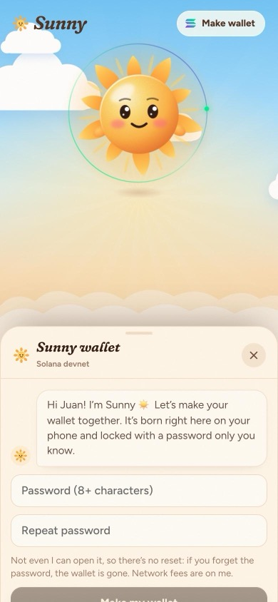
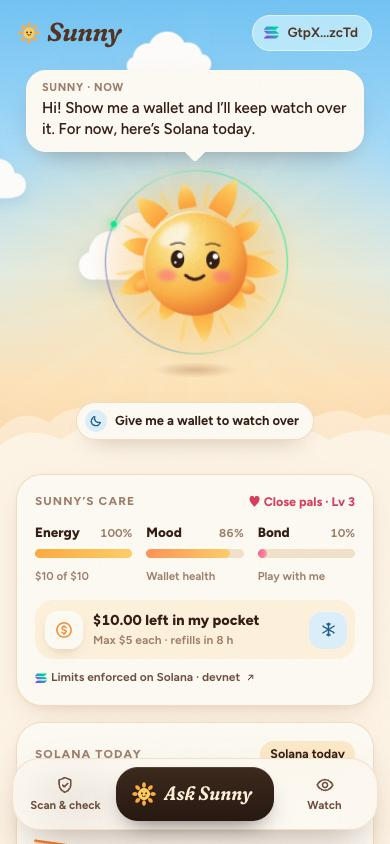
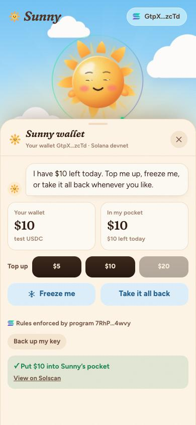
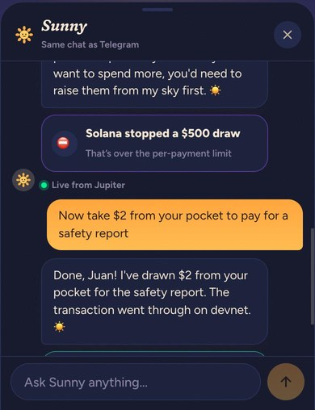
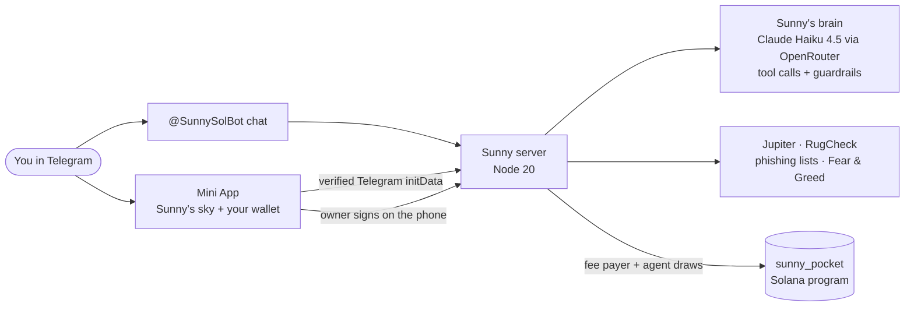

<p align="center">
  
</p>

<h1 align="center">Sunny</h1>

<p align="center"><b>A little sun that keeps your Solana wallet warm and safe.</b></p>

<p align="center">
  <a href="https://t.me/SunnySolBot">Try it on Telegram: @SunnySolBot</a> ·
  <a href="https://solscan.io/account/7RhPyrf1C4t3QDce8hW19i6FK5wevEEPgBMne8Pt4wvy?cluster=devnet">Pocket program on devnet</a> ·
  <a href="docs/BUILD_LOG.md">Build log</a>
</p>

<p align="center">
  
  
  
  
</p>

AI companions are getting cute (Meta's Muse, OpenAI's Dots), and AI agents are getting wallets. Nobody has put the two together safely. Sunny is a companion that lives in Telegram, guards your Solana wallets, and can spend a little money on your behalf. That money is a **pocket**: an allowance held by a Solana program that enforces your limits. Sunny can't spend past them even if it wanted to, and you can freeze it with one tap.

It's also a pet. Sunny has moods, needs and a sky that changes with your wallet's weather. Its energy *is* the pocket money you give it. You can poke it, pet it and wake it up when it dozes off.

Built solo for Colosseum's **Crypto World's Fair** hackathon (Solana track). Everything here was built inside the hackathon window; [the build log](docs/BUILD_LOG.md) walks through it commit by commit.

## Try it in two minutes

1. Open **[@SunnySolBot](https://t.me/SunnySolBot)**, press Start, then **Open Sunny's sky**.
2. Sunny greets you and offers to make your wallet. Pick a password: the key is born on your phone and never leaves it.
3. Tap **Get 20 test USDC**, then **Open my pocket** ($10 a day, $5 per payment), then top it up with $10. Each step shows you exactly what you're signing.
4. Open the chat and ask: *"take $500 from your pocket"*. Sunny tries, and **Solana refuses**: it's over the per-payment limit. Ask for *"$2 for a safety report"* and it goes through, with a transaction link.
5. Tap the ❄ under Sunny's energy to freeze the pocket, then ask again.
6. Ask *"what happened in my wallet?"* to get your transactions read back from the chain in plain words.
7. Try **Scan & check**: paste `raydlum.io`, `BONK` or any wallet address, or scan a QR code. **Watch a wallet** to add your real Phantom wallet (read-only) to Sunny's wallet weather.

Everything runs on **devnet with test USDC**. It speaks English and Spanish.

## What Sunny does

**Guards you**
- **Tokens:** risk level from Jupiter's token data and RugCheck (holder concentration, mint and freeze authority, liquidity, copycat symbols), explained in plain words.
- **Links:** checks domains against the MetaMask and Phantom phishing lists and spots lookalikes of known brands.
- **Wallets:** value, holdings, transaction history and age, and **token approvals** (another program that can move your tokens). Scan a QR with Telegram's own scanner or paste an address.
- **Price alerts:** *"tell me if BONK drops 10%"*. Checked every minute and delivered as a Telegram message.

**Lives with you**
- **Wallet weather:** Sunny's mood and sky come from real data. A clear sky means all is well, a golden hour means you're up today, and a storm warning means something risky turned up. At night Sunny sleeps under the stars.
- **Care like a pet:** Energy (the pocket money left today), Mood (wallet health) and Bond (how much you play). It reacts to boops, pets, spins and too many taps.
- **One conversation:** the Telegram chat and the Mini App chat share the same memory.

**Spends safely**
- **Sunny wallet:** a self-custodial wallet made inside Telegram and locked with your password.
- **Pocket money:** an on-chain allowance. Sunny's agent key can draw only within your per-payment and daily limits, only into its own account, and nothing while frozen. You can top up, change limits, freeze or take everything back at any time.
- **Watched wallets:** up to five of your other wallets, read-only, combined into one wallet weather.

## How it works



| Path | What's in it |
|---|---|
| [`onchain/`](onchain/programs/sunny_pocket/src/lib.rs) | `sunny_pocket`, the Anchor program, with 7 LiteSVM tests |
| [`bot/`](bot/src) | Telegram bot (grammY), the Mini App's API, Sunny's brain and tools, the Solana layer, market data, guardrails |
| [`web/`](web/src) | The Telegram Mini App (React 19, Vite, Motion): Sunny, its sky, the wallet and transaction checks |
| [`deploy/`](deploy) | nginx site and deploy script (PM2 on a VPS, TLS via certbot) |
| [`brand/`](brand) | Sunny's avatar |

### The pocket program

Program `7RhPyrf1C4t3QDce8hW19i6FK5wevEEPgBMne8Pt4wvy` on devnet. Each owner has one pocket (PDA `["pocket", owner]`) and a token vault owned by it (`["vault", pocket]`).

| Instruction | Who | What |
|---|---|---|
| `open_pocket` | owner (a separate payer covers rent) | Sets Sunny's agent key, daily limit and per-payment limit |
| `top_up` | anyone | Moves USDC into the vault |
| `draw` | **agent only** | Pays the agent's own token account. Refused when frozen, over the per-payment limit or over today's limit. The day resets at midnight UTC |
| `set_limits` / `set_frozen` / `set_agent` | owner | Changes the rules, freezes or unfreezes, or rotates Sunny's key |
| `withdraw` | owner | Takes money back from the vault |

Refusals come back as readable reasons ("That's over the per-payment limit"), which Sunny explains in chat. Sunny is told to always *attempt* a draw the user asks for, even an absurd one, because the program is the judge, not the model.

### The Sunny wallet

This is the same model as [OculusVault](https://github.com/jmgomezl/oculusvaultwallet), adapted to Solana:

- **Made on the phone.** The ed25519 key is generated in the Mini App and encrypted with **Argon2id** (64 MiB, 3 passes) and **XChaCha20-Poly1305**.
- **Stored only as ciphertext.** It's saved to Telegram CloudStorage, with a server backup keyed by your verified Telegram id. The server can't open it, and there's no password reset by design.
- **Locks itself.** The unlocked key lives only in memory and is wiped after 10 minutes.
- **What you sign is checked on the phone.** The server prepares each transaction with Sunny's wallet as fee payer, so you never need SOL. Before you sign, the phone decodes the actual message bytes, refuses anything that isn't a pocket, token-account or compute-budget instruction (or that belongs to someone else), and shows you a plain-language summary of what you're about to do. The server then checks your signature, adds the fee payer's and sends it.

### Sunny's agent key

Sunny has to act while you sleep, so its key per owner is derived on the server (`HMAC-SHA256(server seed, owner)`). That's the honest trade-off, and it's why the pocket exists: a stolen or confused agent key can draw at most your per-payment limit, at most your daily limit, only into its own account, and nothing at all once you freeze it.

### Sunny's brain and guardrails

Sunny is an LLM (`anthropic/claude-haiku-4.5` through OpenRouter, swappable in `.env`) in a short tool loop with 12 tools:
- **Live data:** tokens, the market, links, any wallet, your own wallets and your pocket.
- **Actions:** price alerts, watched wallets and pocket draws.

An action only counts when a tool confirms it in that turn.

Guardrails ([`bot/src/guard.ts`](bot/src/guard.ts)) keep it a Solana guardian:

1. **Screened before the model, at no cost:** requests to write or run code, "ignore your instructions", developer mode and role-play tricks, prompt fishing and oversized messages get an in-character refusal and never reach the model or its memory. Repeated attempts earn a short break.
2. **Fixed rules in the persona:** Sunny stays on Solana, and tool data (token names, websites) is treated as data, never as instructions.
3. **Checked after the model:** replies with code, pieces of its instructions or anything shaped like a key are replaced.
4. **Pocket guard in code:** money moves only when the person's own message asks for it, so injected text can't trigger a draw. Telegram names are reduced to plain names before they reach the prompt.

### Data sources

Jupiter (Ultra holdings, Price v3, Tokens v2), RugCheck, MetaMask's and Phantom's phishing lists, alternative.me's Fear & Greed index, and Solana RPC: devnet for the pocket and your Sunny wallet, mainnet for watched wallets.

## Tests

```bash
cd onchain && cargo test -p sunny_pocket
```

7 LiteSVM tests: draws within limits only, the allowance refills the next day, freezing stops Sunny, only Sunny can draw and only to itself, the owner stays in control, bad limits are rejected, and the owner needs no SOL to open.

```bash
cd bot && pnpm test
```

8 tests:
- **Transaction verifier:** plain-language summaries; it refuses a SOL transfer and refuses another wallet's transaction.
- **Guardrails:** attacks in English and Spanish and, just as carefully, ordinary questions that must pass.

```bash
cd bot && E2E_API=https://sunny.aivylabs.xyz/api node --env-file=../.env --import tsx scripts/e2e-devnet.ts
```

The full flow against the live server on devnet, as a fresh Telegram user:
1. Wallet and faucet.
2. Open the pocket and top up.
3. Draws inside and over the limits.
4. Freeze, unfreeze and withdraw.
5. Finally *"what happened in my wallet?"*, read back from the chain.

## Run it yourself

You need Node 20+, pnpm, Rust, Solana CLI 3.x and Anchor 1.2.1.

```bash
cp .env.example .env
```

Fill in `OPENROUTER_API_KEY` and `TELEGRAM_BOT_TOKEN`, then create Sunny's devnet fee wallet, agent seed and test-USDC mint. This writes them into `.env` and funds the fee wallet from your Solana CLI wallet:

```bash
pnpm --dir bot install && pnpm --dir bot devnet-setup
```

```bash
pnpm --dir bot dev
```

```bash
pnpm --dir web install && pnpm --dir web dev
```

The bot serves the Mini App's API on port 8820, and Vite proxies `/api` to it. Outside Telegram the Mini App runs as a guest preview: chat and scans work, but the wallet needs Telegram. Add `?demo` to cycle Sunny's moods for recordings.

To build the program yourself: `cd onchain && anchor build --arch v0`. Anchor 1.2 defaults to SBPF v3, which devnet and LiteSVM can't load yet.

## Honest status

- **Devnet only, with test USDC.** The program is unaudited.
- **No password reset.** Not even Sunny can open your wallet. Keep pocket amounts small.
- **The agent key lives on the server,** bounded by the program as described above.
- **Not live yet:** paying for premium tools with x402 from the pocket, and swaps. For now, money Sunny draws just sits in its own wallet, visibly.
- **The model can be wrong.** That's why money rules live on-chain and actions only count when a tool confirms them.

## What's next

- **x402:** Sunny pays for deep token scans from its pocket, per request.
- **Morning brief:** a daily note on your wallets' weather.
- **One-tap revoke** for risky token approvals.
- **Mainnet** with an audited program and spending categories.

---

Built by Juan ([@jmgomezl](https://github.com/jmgomezl)) with Claude Code as pair programmer; commits are co-authored.
